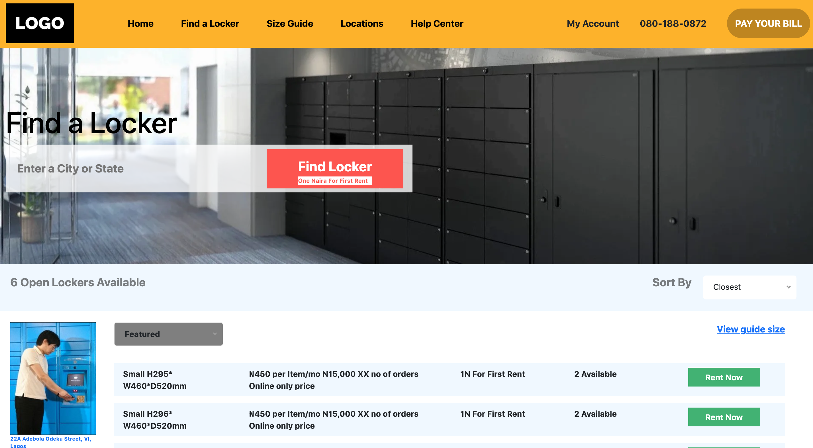

# Hublocker 
<!-- MARKDOWN LINKS & IMAGES (Project shields follow below links for detail)-->
<!-- https://img.shields.io https://www.markdownguide.org/basic-syntax/#reference-style-links -->
 
 

<!-- PROJECT LOGO -->
 

  

  <h3 align="center">HubLocker Skill Project</h3>

  

    An awesome RESTful web application that allows user to search for location lockers using city or state
     
     
    <a href="https://github.com/goodnessemmanuel/hublocker">View Demo</a>
  

## About the Project
 
This application searches for a location locker given an input (i.e. state or city) from a user and show all the lockers at that location.

### Technologies used
 #### Server Side
 * Spring Boot 2+
 * Spring Data JPA (Hibernate)
 * Maven 3.2+ (Package Manager)
 * JDK 11
 * MySQL Database
 * Embedded Tomcat
 
 #### Client Side
 * Angular 11
 * Angular CLI
 * Typescript
 * NodeJS & NPM
 * JDK 11
 * Bootstrap 5

## Author
* Oche Ejeh
